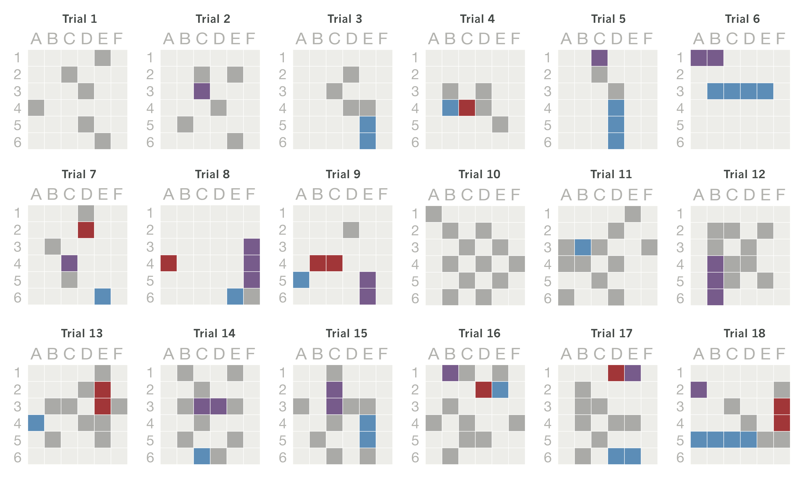

# Human question data set

Data obtained in Experiment 1 in _Rothe, Lake, & Gureckis (2016). Asking and evaluating natural language questions._ [[PDF]](https://mindmodeling.org/cogsci2016/papers/0357/paper0357.pdf)

## Questions

`df.allBySubj.csv` contains all 605 questions and some extra info.

Each row refers to one natural language question that a person asked in the context of a partly revealed game board.


Preview

```{r}
| trial| subj|bin                |type       |paras | para_1| para_2| para_3|full                            |text                                  |
|-----:|----:|:------------------|:----------|:-----|------:|------:|------:|:-------------------------------|:-------------------------------------|
|     1|    7|shipsize(red)      |shipsize   |2     |      2|     NA|     NA|How many tiles is the red ship? |How many blocks is the red ship?      |
|     2|    7|horizontal(purple) |horizontal |3     |      3|     NA|     NA|Is the purple ship horizontal?  |Is the purple ship laying horizontal? |
|     3|    7|shipsize(red)      |shipsize   |2     |      2|     NA|     NA|How many tiles is the red ship? |How many blocks is the red ship?      |
```


Columns

- **`trial` = Context = Partly revealed gameboard (see below)**
- **`subj` = Subject ID**
- `bin` = Program representation of the question
- `type` = Program representation -- function
- `paras` = Program representation -- parameters
- `paras_1` = Program representation -- parameter 1
- `paras_2` = Program representation -- parameter 2
- `paras_3` = Program representation -- parameter 3
- `full` = Natural language representation (as a clean example)
- **`text` = Literal question generated by subject**


## Contexts



```{r }
x <- 1:10
y <- round(rnorm(10, x, 1), 2)
df <- data.frame(x, y)
df
```